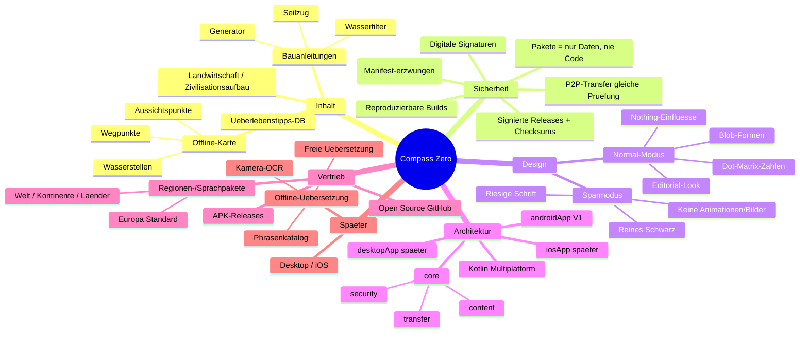

# Mindmap — Compass Zero

```mermaid
mindmap
  root((Compass Zero))
    Inhalt
      Ueberlebenstipps-DB
      Bauanleitungen
        Seilzug
        Wasserfilter
        Generator
      Landwirtschaft / Zivilisationsaufbau
      Offline-Karte
        Wasserstellen
        Aussichtspunkte
        Wegpunkte
    Sicherheit
      Kein Internet (Manifest-erzwungen)
      Pakete = nur Daten, nie Code
      Digitale Signaturen
      P2P-Transfer gleiche Pruefung
      Signierte Releases + Checksums
      Reproduzierbare Builds
    Design
      Normal-Modus
        Editorial-Look
        Blob-Formen
        Nothing-Einfluesse
        Dot-Matrix-Zahlen
      Sparmodus
        Reines Schwarz
        Riesige Schrift
        Keine Animationen/Bilder
    Architektur
      Kotlin Multiplatform
      core
        content
        security
        transfer
      androidApp V1
      desktopApp spaeter
      iosApp spaeter
    Vertrieb
      Open Source GitHub
      APK-Releases
      Regionen-/Sprachpakete
        Europa Standard
        Welt / Kontinente / Laender
    Spaeter
      Offline-Uebersetzung
        Phrasenkatalog
        Freie Uebersetzung
        Kamera-OCR
      Desktop / iOS
```

Hinweis: Falls die Mermaid-`mindmap`-Syntax in einem Viewer nicht rendert, ist die Struktur auch als reine Gliederung in [`DESIGN.md`](DESIGN.md) nachzulesen.
